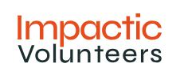
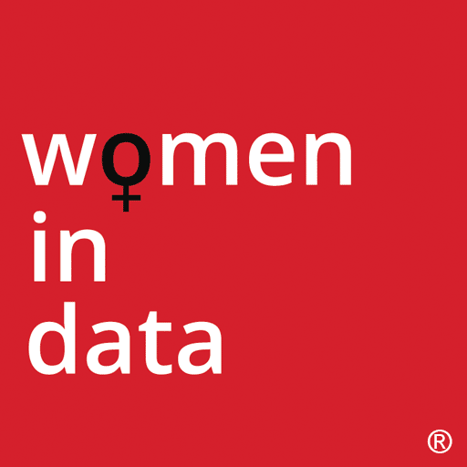

# WiD Hackathon

Working website to code and solve problem for women's health using kaggle 
and NHS data. This hackathon is to attract individuals passionate about data 
science, healthcare, and social impact. It aims to encourage creative 
thinking and problem-solving while addressing crucial issues in women's health.

In partnership with Women in Data, UK, non-profit and Impactic Volenteers

 

**Hackathon Title:** EmpowerHer: Women's Health Data Hack

**Objective:** The objective of this hackathon is to harness the power of open-source tools and data from UK sources such as the National Health Service (NHS) and Kaggle to address critical challenges and opportunities in women's health. Participants are encouraged to explore, analyze, and innovate using available datasets to propose solutions, insights, or applications that advance the understanding and support of women's health.

**Date and Time:**

**Start Date:** 9am Wednesday, March 6th 2024 

**End Date:** 5pm Wednesday, March 6th 2024 

**Duration:** 8 hours

**Results:** Thursday, March 7th 2024

**Venue:**

- In-person event
- InterContinental London - the O2

**Theme:**
- Solving Women's health with data and tech

**Registration:**

- Sign up through women in data website
- 3,000 people for flagship conference, 300 teams max

5 data roles for people to select when signing up to conference 

  - Data Analyst - DA
  - Data Scientist - DS
  - Data Engineer - DE
  - Data SME - DSME
  - Data Product Owner - DPO

**Agenda:**

Registration 8am
Opening Ceremony 9am 
Team Formation

  - Teams of 10 people
  - 1 DPO, 1 DSME, 3 DA, 2 DE, 3 DS

Hacking Period

  - 9am to 5pm 
  - Lunchtime checkpoint for help and support 

Project Submission Deadline 5pm
Judging Period

  - Top 6 finalist presentations 5pm to 6:30pm
  - 
Keynote Speech and Prize Distribution on the day of flagship conference 

Need to decide on what public data to use, examples from kaggle 

- Women Health Care
- Babies Birth Weight
- Breast Cancer 
- Fitbit Tracker
- Cervical Cancer UK
- Worldwide cancer data
- UK Hospital Data

**Problem Statement:** Across various demographics and health sectors, 
women's health remains an area of complex and multifaceted needs. 
Challenges in reproductive health, maternal care, mental health, chronic 
conditions, and overall well-being persist. The aim is to leverage 
available UK data sources to:

1. **Identify Disparities:** Explore and address disparities in access to 
   healthcare, treatment outcomes, or prevalence of certain conditions 
   among different demographics of women.
2. **Enhance Preventive Care:** Develop strategies or tools that promote 
   preventive healthcare measures for women, considering specific age 
   groups, lifestyles, or health concerns.
3. **Mental Health Support:** Explore and devise solutions that support 
   mental health needs unique to women, considering factors like 
   postpartum depression, stress, anxiety, or other mental health challenges.
4. **Health Education and Awareness:** Create platforms, apps, or tools 
   that spread awareness and educate women about various health issues, 
   ensuring accessibility and understanding of healthcare information.

**Tasks:**
Participants are encouraged to:

1. **Explore Datasets:** Utilize datasets from NHS and Kaggle that pertain 
   to women's health. This could include information on demographics, 
   medical records, disease prevalence, treatment outcomes, etc.
2. **Analyze and Visualize:** Analyze the data to identify trends, 
   patterns, and potential areas for improvement in women's health. 
   Visualize key insights to better understand the data.
3. **Develop Solutions:** Propose innovative solutions, which could be in 
   the form of applications, predictive models, educational tools, or any 
   other technological advancement that addresses specific challenges in 
   women's health.
4. **Pitch and Demonstrate:** Present the findings and developed solutions 
   to a panel of judges, explaining the rationale, methodology, and 
   potential impact of the proposed solution.

**Tools and Resources:**
 Participants are encouraged to use open-source tools, libraries, and 
 technologies for data analysis, such as Python (Pandas, NumPy), R, Jupyter 
 Notebooks, machine learning libraries (scikit-learn, TensorFlow), 
 visualization tools (Matplotlib, Seaborn, GeoPandas), and any other 
 open-source resources available.

**Judging Criteria:**
- Innovation and Creativity
- Impact on Women's Health
- Technical Skill and Analysis
- Presentation and Clarity

**Note:** This hackathon aims to create a collaborative environment where 
participants can learn, innovate, and contribute to a meaningful cause in 
women's health.

